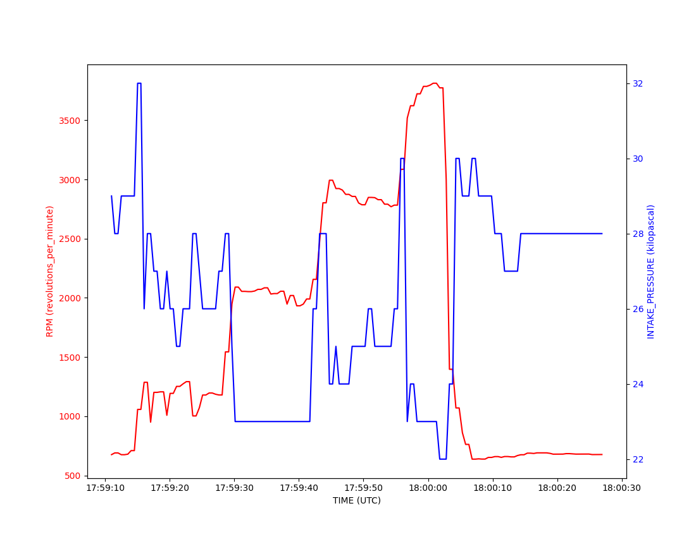
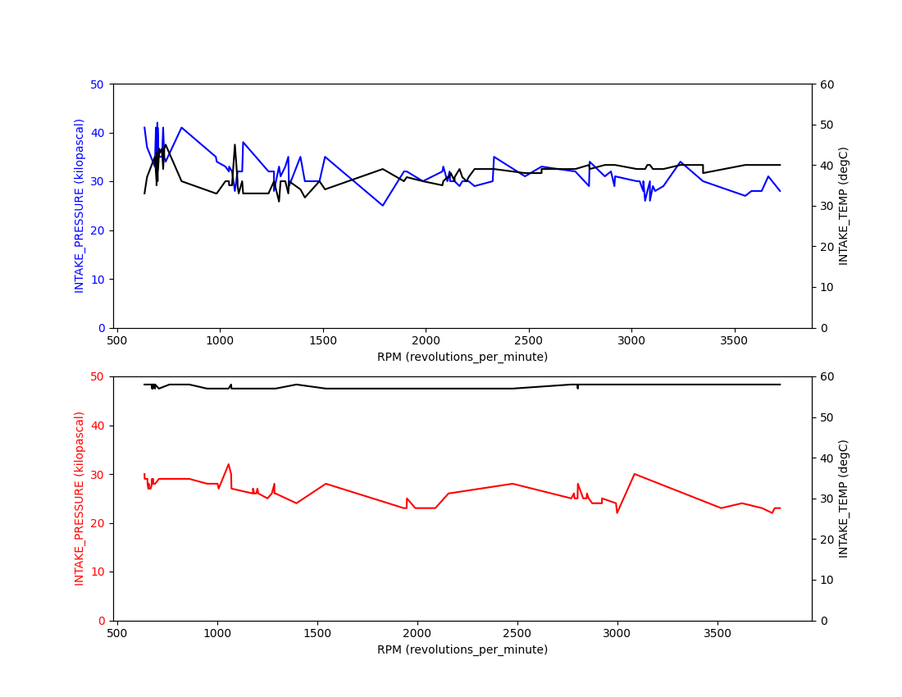

# OBD-II Utilities

This collection of Python scripts makes use of the excellent [Python-OBD](https://github.com/brendan-w/python-OBD/) library. Even though the Python-OBD library is exceedingly easy to use, I hope these scripts simplify the process of automotive troubleshooting. The last thing I want to do when I'm having car trouble is read matplotlib documentation.

The Python-OBD library, thus these scripts, are designed to work with any ELM 327 OBD-II device. I used the [OBD Link EX](https://www.amazon.com/gp/product/B081VQVD3F/ref=ppx_yo_dt_b_asin_title_o00_s00?ie=UTF8&psc=1) purchased from Amazon (ASIN: B081VQVD3F). Out of the box its USB cable was loose at the OBD-II end. It worked fine after disassembling and repinning the JST connector inside. 🙄


## Dependencies
```
> pip install obd
> pip install matplotlib
> pip install pandas
```

## Utilities

### codes.py
Codes.py returns a list of DTCs (diagnostic trouble codes) and other parameter values as a snapshot.  Adjust to taste.

```
> python codes.py

--- codes.py --------------------------------
GET_DTC:  [('P2188', 'System Too Rich at Idle')]
---------------------------------------------
FREEZE_DTC:  None
---------------------------------------------
MAF:  None
---------------------------------------------
INTAKE_PRESSURE:  31 kilopascal
---------------------------------------------
BAROMETRIC_PRESSURE:  96 kilopascal
---------------------------------------------
AMBIANT_AIR_TEMP:  28 degC
---------------------------------------------
ENGINE_LOAD:  25.098039215686274 percent
---------------------------------------------
FUEL_STATUS:  ('Closed loop, using oxygen sensor feedback to determine fuel mix', '')
```

### clear.py
Clear.py clears DTCs from a vehicle, but before doing so it returns a list of DTCs and prompts the user for input to confirm that those codes should be cleared.

```
> python clear.py

--- clear.py --------------------------------
CODES FOUND: [('P2188', 'System Too Rich at Idle')]
---------------------------------------------
Clear diagnostic trouble code(s)? (yes/no) yes
~~~ CODES CLEARED ~~~
---------------------------------------------

```

### log.py
Log.py scans your vehicle for supported OBD-II commands and outputs their values in CSV format at a rate of about 2 Hz. This rate can be increased, but I found it to be sufficient for my needs. In an effort to keep this script simple it relies on standard output redirection (`>`) for writing data to a file. -not the most robust data collection technique, but for shade tree mechanics it should be sufficient. Run this script then let your vehicle idle or go for a drive. Use `ctrl + c` to interrupt its execution. Use chart.py and comp.py to review the collected data.

```
> python log.py > data.csv
```

### chart.py
Chart.py is useful for those times when you'd like to plot one parameter only or compare one parameter to another with a common x-axis.

`x_axis = 'TIME (UTC)'`

`y_axis = 'RPM (revolutions per minute)'`

`y_axis_alt = 'INTAKE_PRESSURE (kilopascal)'`

```
> python chart.py
```



### comp.py
Comp.py compares one parameter across two different datasets. For example, say you wanted to compare intake pressure values before and after a vehicle's manifold air pressure sensor was replaced with respect to engine RPM. -accommodates an optional secondary y-axis; intake temperature shown.

`data_1 = 'log_before_MAP.csv'`

`data_2 = 'log_after_MAP.csv'`

`plot_name = 'test.png'`

`x_axis = 'RPM (revolutions_per_minute)' # often 'TIME (UTC)'`

`y_axis_1 = 'INTAKE_PRESSURE (kilopascal)'`

`y_axis_2 = 'INTAKE_PRESSURE (kilopascal)'`

`y_axis_alt = False`

```
> python comp.py
```


